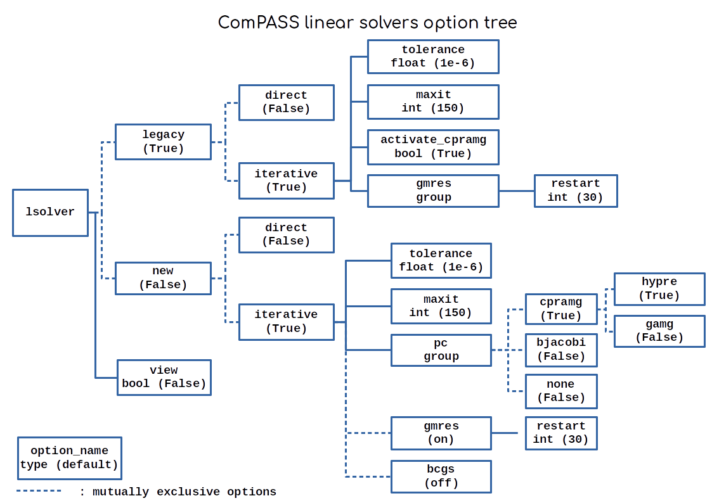

Using command line options
==========================

It can be useful to set the behaviour of a simulation without changing the script. In ComPASS this can be done by passing
keywords in the shell (command line options) when running a case. The callback options trigger situation-specific
events, and the linear system options allow the tuning of the linear solver parameters.
ComPASS options are implemented with Farid Smai's option package `inept <https://pypi.org/project/inept/>`_,
using hierarchy trees.

To activate options, the user has to set the value of the option nodes of the tree.
Setting the value of a node will activate all nodes along the path that leads to it, as well as all children
values with a default (in parentheses). Dashed lines denote a `switch` relationship between the nodes they are connected to,
meaning that they cannot be simultaneously activated. Turning one of them on will turn the others off.
Group nodes cannot be assigned a value: they are just a namespace for the option tree that comes after them.
They can only be activated if the path that leads to them is, and their subtree options are set (or have a default value).

The subtrees that are activated by command line options at runtime are stored in two `Config` objects, and
are used by the ``linalg/factory.py`` to construct the corresponding `LinearSolver` object and by the `ComPASS.callbacks` module
to set up the callbacks functions that will be used.

In ComPASS the default linear solver `Config` when no runtime options are passed yields a Legacy iterative solver which performs a GMRES
procedure with the CPR-AMG preconditioning method, and the callback `Config`
only sets up the simulation log, as can be read on the diagrams above.

+------------------------------------------------+-----------------------------------------------------+
| **callbacks** option keyword                   | Description                                         |
+================================================+=====================================================+
| ``abort_on_linear_failure <True/False>``       | | Interrupt execution when a linear                 |
|                                                | | solve error occurs                                |
+------------------------------------------------+-----------------------------------------------------+
| ``abort_on_newton_failure <True/False>``       | | Interrupt execution when Newton loop              |
|                                                | | fails to converge                                 |
+------------------------------------------------+-----------------------------------------------------+
| ``dump_system_on_linear_failure <True/False>`` | | Write linear system (operator, RHS and residual   |
|                                                | | history) in a file and store it in the output     |
|                                                | | directory in case of linear solve error           |
+------------------------------------------------+-----------------------------------------------------+
| ``abort <t>``                                  | | Interrupt execution at specified physical time    |
+------------------------------------------------+-----------------------------------------------------+
| ``timeloop_log <True/False>``                  | | Write informations about the time steps,          |
|                                                | | the Newton and the linear solver convergences     |
|                                                | | in yaml files in `time_step_log` directory in     |
|                                                | | the output directory                              |
+------------------------------------------------+-----------------------------------------------------+
| ``linear_system_dump <t1,t2,...>``             | | Write linear systems (operator and RHS) in  files |
|                                                | | and store them in the output directory at         |
|                                                | | the specified physical times                      |
+------------------------------------------------+-----------------------------------------------------+
| ``linear_system_binary_dump <t1,t2,...>``      | | Write linear systems (operator and RHS) in        |
|                                                | | binary files and store them in the output         |
|                                                | | directory at the specified physical times         |
+------------------------------------------------+-----------------------------------------------------+

**Remark**: if you prefer, you can also specify the options in the simulation script using:

.. code:: python

  from ComPASS import options
  options.compass_config["callbacks.timeloop_log"] = True

.. _shell_syntax_target:

Shell syntax
~~~~~~~~~~~~

Accessing inner options is achieved with the following syntax:

.. code:: console

  $ python3 <script_name>.py --<layer1_option>.<layer2_option>.<layer3_option> value

This will activate every node along the path to the ``<layer3_option>`` and assign ``value`` to it. For
example command:

.. code:: console

  $ python3 <script_name>.py --lsolver.legacy.direct True

will trigger constructor for an LU solver in the legacy implementation. Note that default values
will activate the subtree automatically, meaning that:

.. code:: console

  $ python3 <script_name>.py --lsolver.new True

is equivalent to:

.. code:: console

  $ python3 <script_name>.py --lsolver.new.iterative.gmres.restart 30

and will trigger constructor for an iterative solver in the new implementation, using GMRES
with CPR-AMG preconditioning, 1e-6 relative tolerance, 150 maximum iterations and a restart of 30.
This makes the syntax shorter when only switching between low level options.

For more information on linear solving options, see :ref:`the linear solver guide <linear_solvers>`
