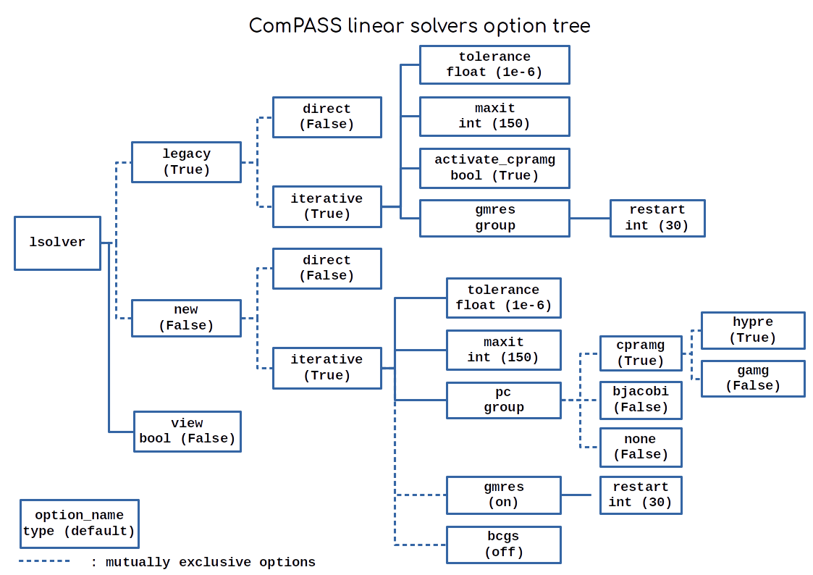

.. meta::
    :scope: version4

Linear solvers
==============

Linear systems in ComPASS are solved using specific objects called
LinearSolver implemented in the `ComPASS.linalg` package. This document
describes the implementation of linear solvers in ComPASS and sums up a
few strategies so you can manage your own solvers.

Different types of solvers and implementations
----------------------------------------------

In ComPASS there are two kinds of linear solvers, direct and iterative,
each having two different possible implementations. Direct solvers use
an LU decomposition of the matrix to find a solution to the linear
system :math:`Ax=b`. This type of solver can solve any system, but is
not parallelizable and costs about :math:`\frac{2}{3}n^3` operations
(with :math:`n` the matrix size), which makes it not
suitable for large problems. It should be used for small systems, or
when iterative solvers don’t converge.

Iterative solvers use a Krylov method with preconditioning to
iteratively reduce the distance between an arbitrary first guess and the
solution. The convergence of this type of solvers is highly dependent on
the preconditioner quality, meaning that basic preconditioners will lead to
slow convergence or even divergence in case of complex physics, like in
the ComPASS context. The default preconditioning method in ComPASS is
:ref:`CPR-AMG <cpramg>`, an efficient method designed for linear systems in the context
of Darcy flow physics. By default, a GMRES procedure with CPR-AMG preconditioning
is used in ComPASS simulations.

Each of these linear solvers has two different implementations : the
`Legacy` and the `Petsc` versions. The default is still the
`Legacy` implementation and uses Fortran routines included in the core part of the ComPASS code, while the
latter is a new implementation that uses the petsc4py interface.
Eventually the `Legacy` version is bound to disappear, but more tests
have to be made with the newer `Petsc` implementation to
guarantee accurate and robust results.

.. _command_line_options:

Command line options
--------------------

One comfortable way to access the inner linear solver parameters is to use command line options.
ComPASS options are implemented with Farid Smai's option package `inept <https://pypi.org/project/inept/>`_,
using the following hierarchy tree. See :ref:`the option documentation for ComPASS<shell_syntax_target>`
for further information on option usage.

The table below describes the different keywords for linear solver setting in ComPASS. More information on
numerical linear algebra can be found in `PETSc user's guide <https://petsc.org/release/docs/>`_, and a
description of the CPR-AMG preconditioning method can be found :ref:`here <cpramg>`.

.. list-table:: Description of the options
   :widths: 25 100
   :header-rows: 1

   * - Option keyword
     - Description
   * - ``view``
     - Display a short paragraph describing the solver parameters in ComPASS shell output
   * - ``legacy``
     - Historical implementation using the Fortran bindings to PETSc
   * - ``new``
     - Modern implementation using the petsc4py API in the `ComPASS.linalg` package
   * - ``direct``
     - Direct solver using LU decomposition
   * - ``iterative``
     - Krylov iterative method with preconditioning
   * - ``tolerance``
     - Relative decrease in the residual norm required for convergence
   * - ``maxit``
     - Maximum number of iterations accepted before convergence failure
   * - ``gmres``
     - GMRES Krylov method developed by Youssef Saad
   * - ``bcgs``
     - BiCGStab Krylov method
   * - ``cpramg``
     - Use the CPR-AMG preconditioning method
   * - ``bjacobi``
     - Use local ILU preconditioner on diagonal blocks
   * - ``none``
     - Do not use any preconditioner (Not recommended)
   * - ``activate_cpramg``
     - Legacy parameter for activating CPR-AMG. Setting it to False will trigger a block Jacobi preconditioner instead
   * - ``restart``
     - The number of iterations at which GMRES restarts
   * - ``hypre``
     - Use Hypre BoomerAMG procedure as the multigrid procedure in CPR-AMG
   * - ``gamg``
     - Use PETSc's built-in AMG procedure as the multigrid procedure in CPR-AMG

For example, to run sequentially `your_script.py` using a Petsc direct solver and display a short view
you can execute the following line:

.. code:: python

    python3 your_script.py --lsolver.new.direct True --lsolver.view True

Instanciate your own linear solver object
-----------------------------------------

Command line options are useful for testing purposes when you don't want
to modify the script. However when defining a new test case with specific
solver parameters, it can be useful to have direct access to the solver object.
This is done using the factory function from the `ComPASS/linalg` package.
This function takes in the required parameters (at least the simulation object)
and returns the instanciated `LinearSolver` object.
Follows the declaration of this function with the default values of the optional arguments.

.. literalinclude:: ../ComPASS/linalg/factory.py
   :linenos:
   :language: python
   :pyobject: linear_solver
   :end-before: """

The `LinearSolver` object must then be passed to the Newton object constructor.
The Newton constructor takes at least four
arguments : the simulation object, the relative tolerance on residual
decrease to achieve Newton convergence, the maximum number of Newton
iterations, and a linear solver object.
The example below shows how to use an iterative solver of the petsc4py implementation
(``Petsc``), after setting its parameters in the script.

.. literalinclude:: ../test/linalg/iterative_solving.py
   :caption: ComPASS/test/linalg/iterative_solving.py
   :linenos:
   :lines: 3-

Extra docs and examples
-----------------------

A few scripts can be found in the `test/linalg` directory and can serve as
examples on how to set and use linear solvers in ComPASS. Extra doc on
the CPR-AMG preconditioning method and its implementation in the
``Petsc`` version can be found :ref:`here <cpramg>`.

.. literalinclude:: ../test/linalg/direct_solving.py
    :caption: ComPASS/test/linalg/direct_solving.py
    :linenos:
    :lines: 3-
    :language: python

Notes on the two different versions
~~~~~~~~~~~~~~~~~~~~~~~~~~~~~~~~~~~

It is deliberately hidden that both implementations use the
PETSc library, because we want them to be considered distinct.
The ``Legacy`` version uses the Fortran interface, and
the ``Petsc`` version uses the petsc4py bindings. Since both strategies
initialize PETSc, using multiple types of solvers in the same execution
can lead to unexpected behaviour. This means **you should not have
instances of both the** ``Legacy`` **and** ``Petsc`` **versions at the
same time during an execution.**

Both versions are essentially identical, but there are a few things to
note on the ``Legacy`` version :

* it has been the default implementation for a while and has been, tested on many different simulations, so it should be reliable.
* the PETSc objects in the Fortran layer are global, which means that it is not possible to have multiple ``Legacy`` linear solver instances. A new instanciation will overwrite the settings of the first, and both Python instances will refer to the same Fortran Petsc objects whereas the new ``Petsc`` version allows the instanciation of multiple linear solver and system objects, which can be manipulated independantly.
